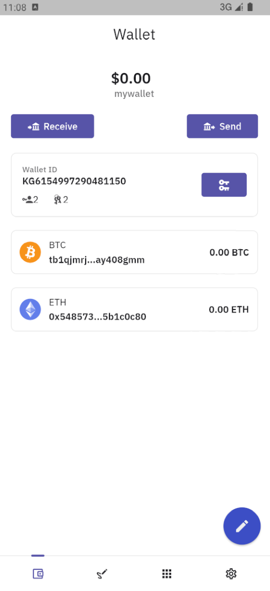
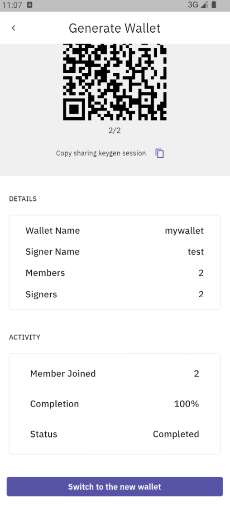
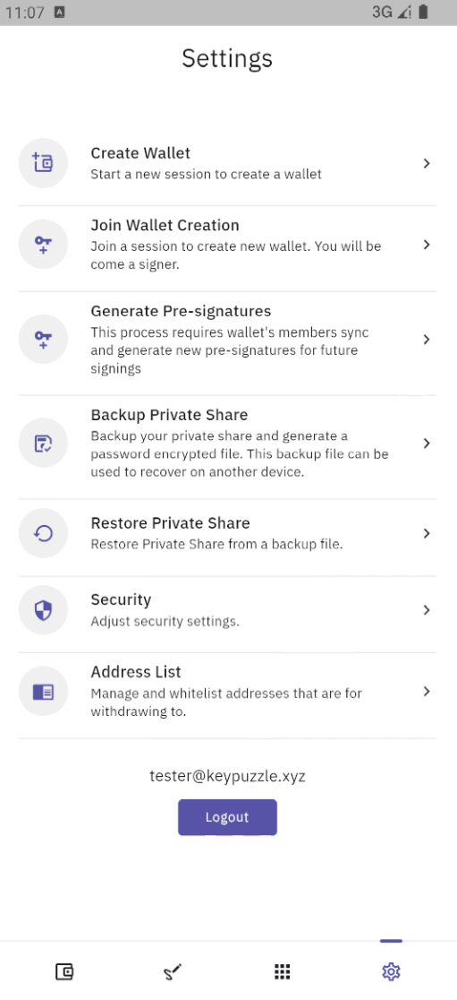
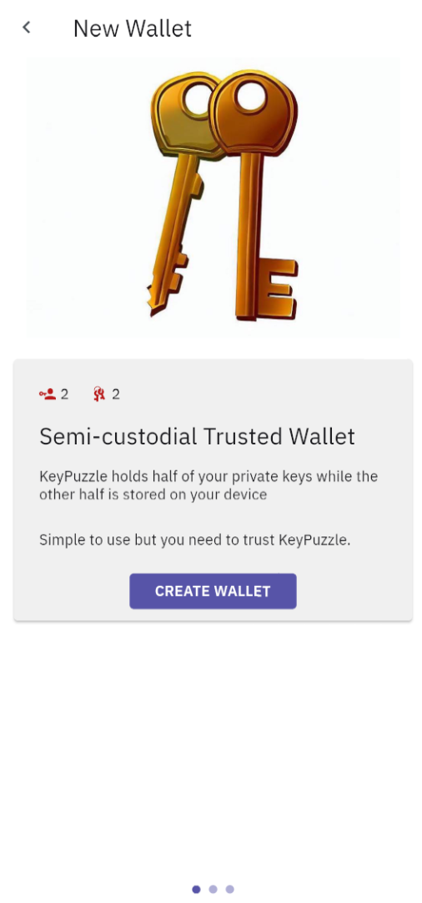
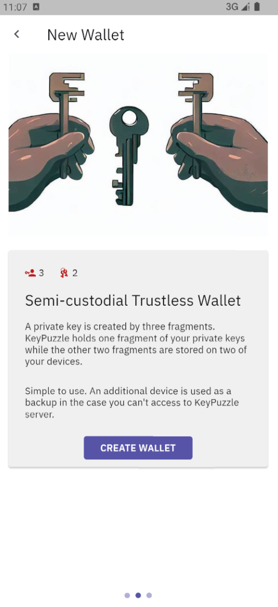
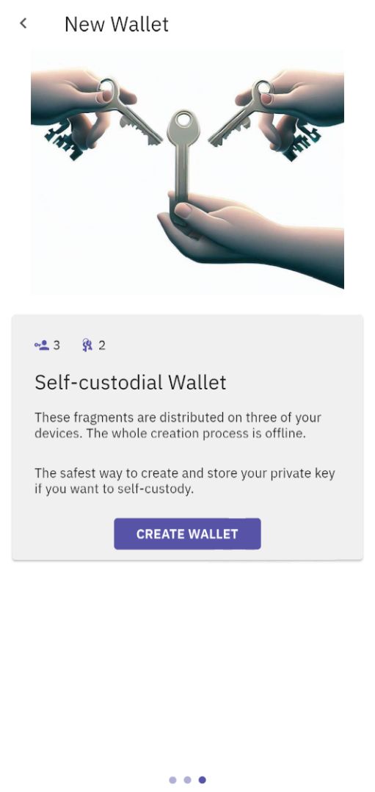
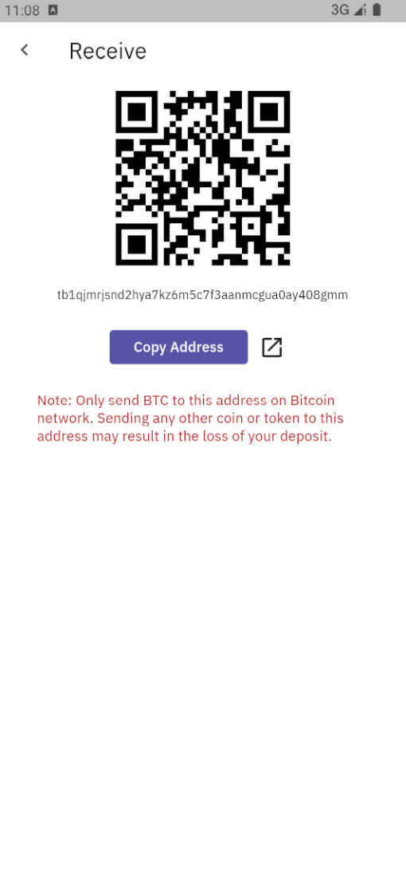
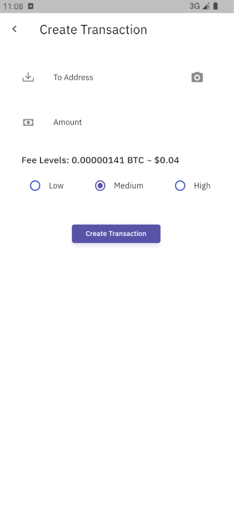
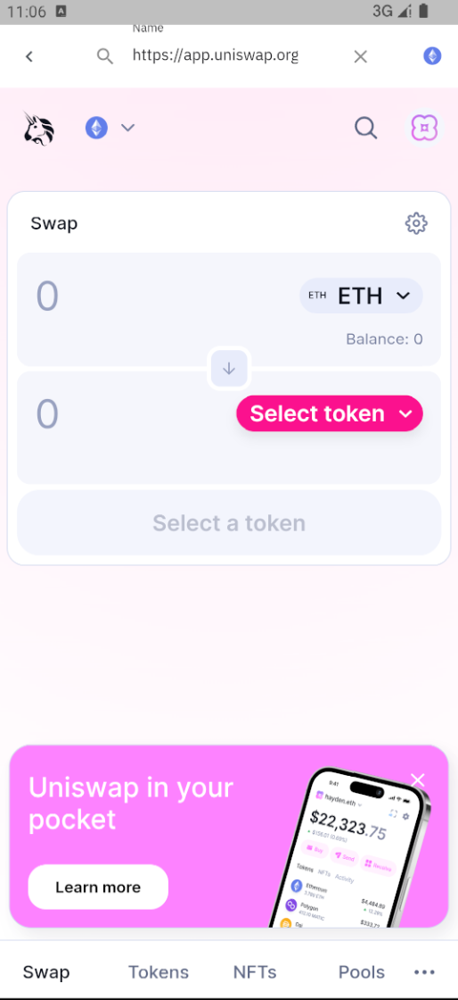
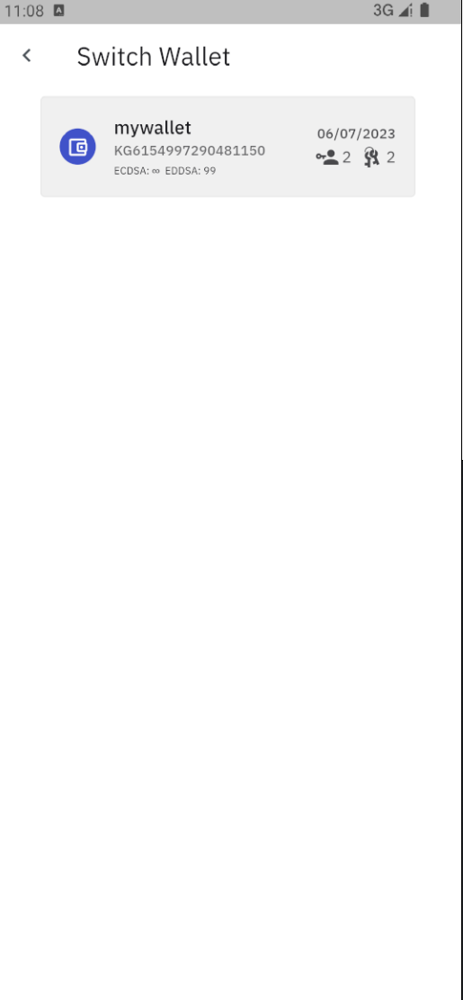

## Mobile App

* This is a proof-of-concept implementation of a multi-party computation (MPC) crypto wallet frontend in Flutter.
* The wallet uses the core blockchain library and threshold signature library, which are also included in this GitHub repository.
* The backend code is not included
* the pictures used in the app are AI-generated ;)

## Features

* Decentralized keygeneration
* Offline and online part signing
* Manage multiple wallets
* Send and receive fund
* Integrated defi browser
* Backup and restore wallet
* Address whitelist

## Screenshots

